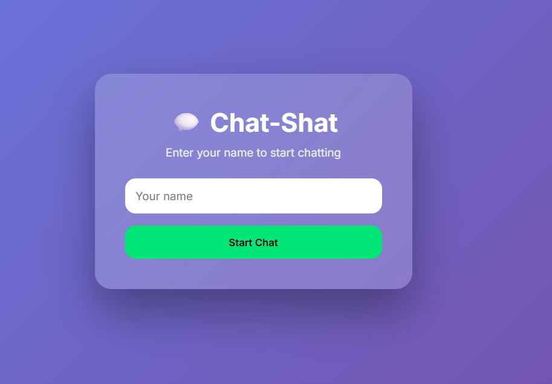
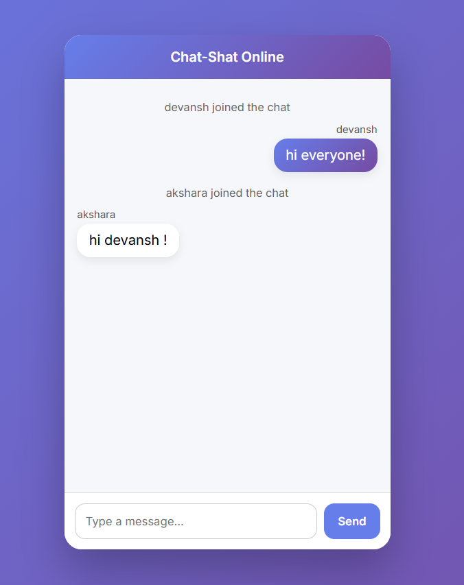

# 💬 Chat-Shat — Real-Time Chat Application

A modern **real-time chat application** built using **Spring Boot + WebSockets**, featuring a clean UI, smooth UX, and instant messaging without page reloads.

> Minimal
> Fast
> Real-time

---

## 🚀 Features

✨ **Real-time messaging** using WebSockets  
👤 **Username-based entry** (no login required)  
💬 **Instant message delivery** (no refresh)  
🕒 **Timestamp below every message**  
📱 **Fixed-size chat window with smooth scrolling**  
🎨 **Modern UI with clean chat bubbles**  
🔁 **Automatic scroll to latest message**  

---

## 🛠️ Tech Stack

### Backend
- **Java**
- **Spring Boot**
- **Spring WebSocket**
- **STOMP Protocol**

### Frontend
- **HTML5**
- **CSS3 (Modern Flexbox layout)**
- **Vanilla JavaScript**

### Build & Tools
- **Maven**
- **Git & GitHub**
- **Railway (Deployment)**

---

## 📂 Project Structure

```text
spring-boot-chat-app/
├── src/
│   └── main/
│       ├── java/
│       │   └── com/example/chat/
│       │       ├── ChatApplication.java
│       │       ├── config/
│       │       │   └── WebSocketConfig.java
│       │       ├── controller/
│       │       │   └── ChatController.java
│       │       └── model/
│       │           └── ChatMessage.java
│       └── resources/
│           ├── static/
│           │   ├── index.html
│           │   ├── css/
│           │   │   └── main.css
│           │   └── js/
│           │       └── main.js
│           └── application.properties
├── pom.xml
└── README.md
```

## 📸 Screenshots

### Username Page


### Chat Page



